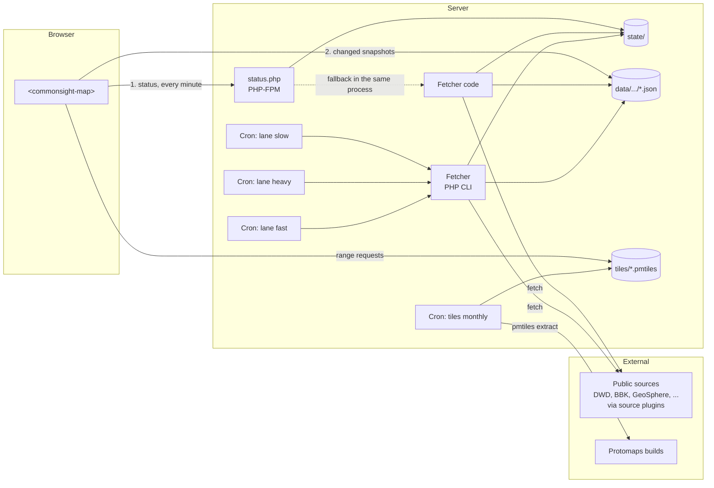
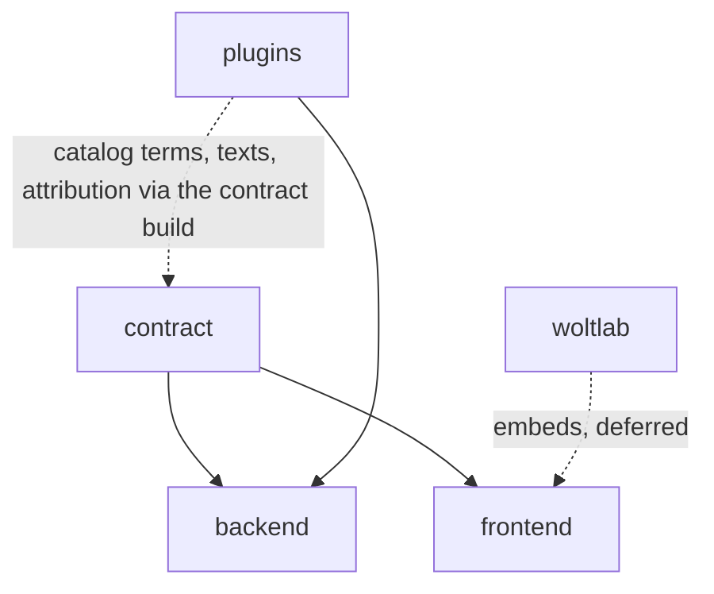
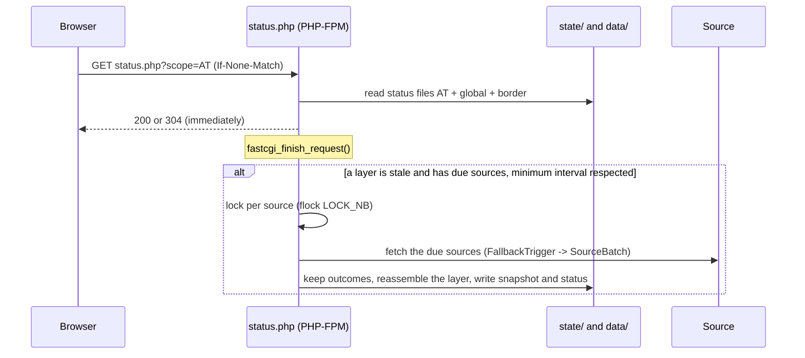
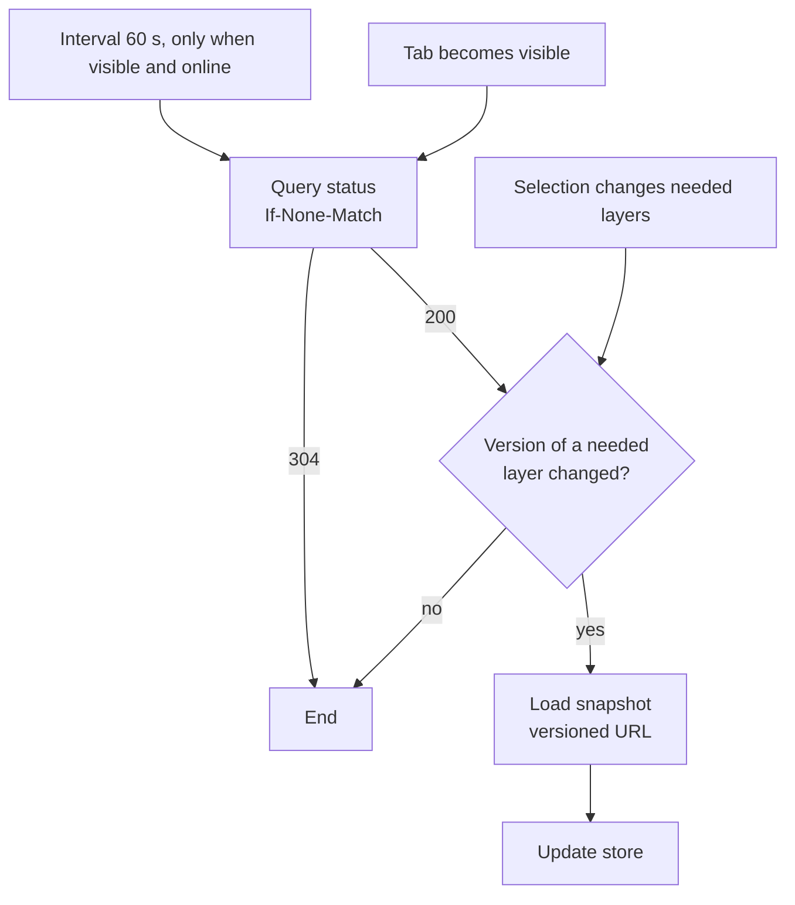
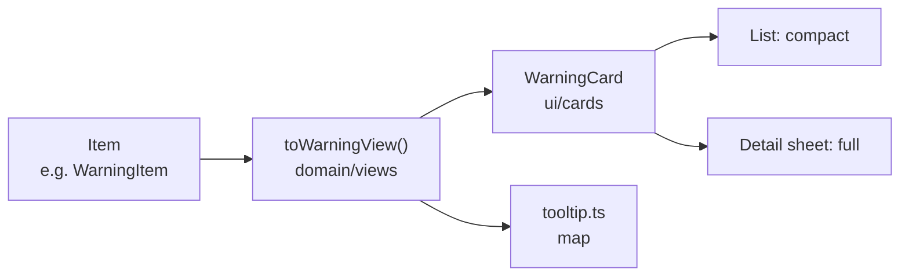

# Architecture and implementation: CommonSight

As of: 2026-10-03 (fetcher in PHP; sources as plugins; decisions V1 to V23, see section 14)
This document describes the **how**: building blocks, interfaces, flows, layout on the server, technologies, build, test and operation. The **what** is described in `REQUIREMENTS.md`.

---

## 0. Reading notes

- This document makes its own **decisions**. They carry an identifier **V1, V2, ...** and are collected in section 14. V1 to V17 were accepted on 2026-09-28 (except the withdrawn V12), V18 to V23 with the plugin model on 2026-10-03 (`internal/SOURCE-INTEGRATION.md`).
- References to requirements in the form `Q-W-AT-10`, `U-50` etc. refer to `REQUIREMENTS.md`.

---

## 1. Overview

### 1.1 Building blocks

On the server there is **only PHP**. Node.js is needed exclusively for building the frontend, on the developers' machines or in CI.

| Building block | Technology | Runs where | Task |
|---|---|---|---|
| **Fetcher** | PHP without framework | cron on the server (one line per lane); as fallback in the status endpoint | run the source plugins, assemble the layers, assess, assign regions, write snapshots |
| **Source plugins** | PHP packages in `plugins/` | inside the fetcher | one per source: fetch it, read its format, map it to the model (V18) |
| **Status endpoint** | PHP without framework, same code base as the fetcher | Apache/PHP-FPM | deliver the status of all layers, check age, reload a layer when needed |
| **Snapshots** | static JSON files (precompressed) | Apache | data of one layer, immutable per version |
| **Tiles** | PMTiles archive DACH | Apache, range requests | basemap |
| **Map assets** | glyphs (PBF), region boundaries, DACH mask, border zone | Apache | labels, region outline, clipping |
| **Frontend** | custom element with Shadow DOM; core in TypeScript, UI in React, map with MapLibre | browser | display, interaction, refresh |
| **Host page WoltLab** (deferred, section 11) | WoltLab package (PHP, templates, XML) | WoltLab | page, group permission, options, mapping of the style variables |
| **Tile job** | Bash + `pmtiles` (Go binary) | monthly cron | create the PMTiles archive from the Protomaps builds |

### 1.2 Data flow



Core idea (V1): the browser queries **one small status file**. It names the current version for each layer. Only when a version has changed does the browser load the snapshot, and it does so under a **versioned URL** that never changes and may therefore be cached indefinitely.

### 1.3 Architecture principles (binding)

These principles implement requirements N-01 to N-06. They apply equally to backend and frontend and take precedence over convenience, brevity or habit. A violation is a bug, not a matter of style.

#### 1.3.1 One responsibility per building block

- Every class, every module and every function has **exactly one responsibility**. It can be described in one sentence without "and". This sentence is the doc comment above the class or module.
- A building block does **only** what its responsibility requires. It does not log on the side, does not read configuration on the side, does not format texts on the side and does not catch errors whose consequences it is not supposed to decide.
- A function works on **one level of abstraction**. It either controls a flow by calling other functions, or it computes itself. Both together get separated.
- **No catch-all classes.** Names like `Utils`, `Helper`, `Manager`, `Common`, `Misc` or a class `Feeds` for all sources are forbidden. The name says what the building block does (`ExpiredItemFilter`, `DwdWarningMapper`).
- There are no two building blocks that do the same thing. A pattern that occurs several times becomes **one** building block with exactly that responsibility, not a base class with mixed behavior.

#### 1.3.2 Separation of task types

Every building block belongs to exactly **one** of these types. Mixing is not allowed.

| Type | Does | Does not | Examples |
|---|---|---|---|
| **Model** | holds data, checks its validity on creation | computes no domain logic, no I/O | `Item`, `Snapshot`, `Assessment`, `Msg` |
| **Domain logic** | computes: parse, map, assess, filter, assign, decide | no I/O, no clock, no randomness, no logging, no reading configuration; the result depends only on the inputs | `DwdWarningParser`, `GermanWaterAssessor`, `RegionMatcher`, `StalenessPolicy` |
| **Input/output (adapter to the outside)** | talks to exactly one external system: HTTP, file system, locks, clock, browser API, MapLibre | no domain decisions | `CurlHttpClient`, `SnapshotFileWriter`, `FileLock`, `SystemClock`, `StatusApiClient` |
| **Flow control** | calls building blocks in the right order, passes results on, logs | computes nothing domain-related itself, knows no source formats | `LaneRunner`, `SourceBatch`, `LayerPublisher`, `FallbackTrigger`, `RefreshScheduler` |
| **Entry point** | receives inputs (CLI arguments, HTTP request, element attributes), wires the objects together, starts the flow control | no logic beyond that | `bin/fetcher.php`, `public/status.php`, `element.ts` |
| **Presentation** (frontend only) | displays state, reports user actions | loads no data, computes no domain logic, knows no snapshot formats beyond what is displayed | React components in `ui/` |

Consequence: all domain logic is testable without network, file system and clock (12.4).

#### 1.3.3 Dependencies

- **Direction:** entry point -> flow control -> domain logic -> model. Input/output is passed into the flow control via interfaces. Domain logic and model depend on nothing above them, and never on input/output. Cycles are forbidden.
- **Explicitly via the constructor.** Every building block receives exactly the dependencies it needs, and no others. No catch-all objects that contain "everything" (no context or container object that is passed through), no service locator, no global variables, no static calls with side effects, no `new` for services inside domain logic or flow control.
- **One exception, the plugin's boundary (V20):** a plugin receives its services once, at creation, as `PluginEnvironment` (HTTP client, store, secrets, XML reader, data). The factory of the plugin hands each part only what it needs; the environment is not passed on inside the plugin.
- **Plugins** depend only on model, SDK and ports; the core depends on no plugin, and plugins do not use each other (`deptrac` and `PluginIsolationTest`).
- **Configuration** is read and validated in exactly one place (`Config`). Every building block receives only its slice as a separate, typed object (e.g. `HttpLimits`, `Lanes`, the raw settings of each layer, which the layer validates itself), never the whole configuration.
- **Wiring** happens only in the entry point or in a factory responsible for it per entry point (`FetcherFactory`, `StatusEndpointFactory`). Only there is it stated which concrete class fulfills which interface.

#### 1.3.4 Errors

- Whoever **detects** an error reports it (return value or exception with a domain type). Whoever **decides the consequence** is a different building block. Example: the parser reports an invalid record; whether the layer becomes `partial` because of it is decided by the `SnapshotAssembler`.
- Only the flow control logs. Domain logic does not get a logger.
- Errors are not swallowed. A `catch` without a decision about the consequence is forbidden.

#### 1.3.5 Interfaces and data

- Building blocks exchange **typed values** (model classes, value objects), not loose arrays with changing keys.
- An interface offers only what its users need. Better two small interfaces (`SnapshotReader`, `SnapshotWriter`) than one large one.
- Side effects are in the name: `write...`, `fetch...`, `acquire...`. Functions without such a name have none.
- **One strict contract per item kind (V15, revised).** What leaves a plugin is an item of the model, valid against `item.schema.json` (checked for every plugin on its recordings). Inside its package a plugin may keep types in the **vocabulary of its source** (e.g. `Plugin\Pegelonline\Record\Station`, `Plugin\GeoSphere\Record\WarnFeature`); only its parser creates them, only its mapper translates them, and no building block outside the package knows them. Behind the parser there are no raw arrays of the source any more. Readings that several sources share (gauges, probes) use the types of the SDK (`Sdk\Station`).
- **Value objects instead of bare numbers and strings (V15),** where confusion is possible: `Coordinate` (checks the value range, named `lat`/`lon`, created from `fromLatLon()` or `fromLonLat()` so that the order of the source is explicit when reading), `UtcInstant` (absolute point in time, output only as ISO 8601 with `Z`, D-12), `DoseRate` (normalizes nSv/h to Sv/h), `WaterLevel` with reference (gauge zero or height above sea level), `Discharge`, `RegionId`, `LayerId`. Background: the sources deliver coordinates in different orders (MeteoAlarm and Autobahn `lat,lon`, ÖAMTC `lat lon`, GeoJSON `lon,lat`) and water levels with different references (cm above gauge zero, m above sea level).
- **Items are separated by kind (V14).** `Item` is a union of kinds (3.2). Code that works with items distinguishes the kinds explicitly and exhaustively (exhaustive `match` or `switch`), not via the presence of optional fields.

#### 1.3.8 Names

- Code, comments in code and identifiers are in English. One name per concept is ensured by the **catalogs** instead of a glossary (V17, V22): every quantity, category and feed is registered once with id, German label, unit and definition (`contract/catalog/`); the build lists all terms in `contract/catalog/TERMS.md`, so that duplicates stand out in review.
- The record types of a plugin keep the field names of its source, so that parser and source documentation are easy to compare. The translation into the terms of the model happens in its mapper.

#### 1.3.6 Size as a warning signal

What matters is the responsibility, not the line count. The following values are therefore **triggers for a review**, not free passes below them:

| Metric | Review from |
|---|---|
| Lines per function | 30 |
| Lines per class | 200 |
| Parameters per function | 4 |
| Dependencies in the constructor | 5 |
| Cognitive complexity per function | 10 |

If a value is exceeded, the building block is split, or the excess is justified in code review and noted on the building block.

#### 1.3.7 Enforcement

- **Automatic:** dependency rules as a test in `./dev.sh test` (V13): `deptrac` for the backend, `dependency-cruiser` for the frontend. Size and complexity via PHPStan and ESLint rules. A violation breaks the build.
- **In review:** checklist per change: responsibility in one sentence? Exactly one task type? Only needed dependencies? Domain logic tested without I/O?
- **Definition of Done:** a building block is done when it follows the rules, its responsibility is documented and it is tested in isolation.

---

## 2. Repository

### 2.1 Structure (V7)

Two independent projects, connected via the shared schema and shared master data, plus the plugin packages of sources and layers as a second shared place (V18, V24):

```
commonsight/
├─ contract/          the contract between backend and frontend
│  ├─ schema/         JSON Schema: snapshot, item, assessment, msg, status; catalog and layers (generated)
│  ├─ data/           master data as JSON: countries, cities, border places, regions, links, attribution
│  ├─ catalog/        catalog terms of the core (builtin.json) and, generated, of all plugins; sources.json, layers.json, TERMS.md
│  ├─ messages/       texts of the core (de.json) and, generated, of the plugins (plugins.de.json)
│  ├─ regions/        region areas in full resolution (for the assignment in the fetcher)
│  ├─ testcases/      shared test cases (e.g. freshness check), read by both test suites
│  └─ fixtures/       sample snapshots, created by the backend tests, read by the frontend tests
├─ backend/           Composer project (PHP): fetcher and status endpoint
│  ├─ src/            namespace CommonSight\...
│  ├─ bin/fetcher.php CLI entry point
│  ├─ public/         status.php, .htaccess templates
│  └─ tests/
├─ plugins/           one package per source or layer: manifest, backend code, texts, data, tests; a source also catalog
│  │                  terms and its profile, a layer its frontend part and LAYER.md (4.1, 9.1)
│  ├─ layers/<id>/    the layers (water, warnings, …)
│  ├─ news/<id>/      the news feeds (news-orf, …)
│  └─ providers/<id>/ the data providers (pegelonline, dwd-warnings, …)
├─ frontend/          npm project: custom element and start page (structure in 9.1)
├─ map-assets/        region outlines, DACH outline, border zone and mask for the map
├─ tools/
│  ├─ regions/        preparation of region boundaries, DACH outline, mask (mapshaper, runs only locally)
│  ├─ stations/       master data of stations without names or positions in their source, written into their plugins
│  ├─ projection/     reference points for the EPSG:31287 conversion (test data)
│  ├─ tiles/          update-tiles.sh, fetch-map-assets.sh
│  └─ record/         record-plugin.php: records the responses of a plugin into its tests/responses/
└─ doc/               architecture and requirements
```

### 2.2 Dependencies



- `backend` and `frontend` do **not** know each other directly. Both depend only on `contract`.
- Source plugins have only a backend part; what the frontend needs from them (terms, texts, attribution) reaches it through the generated files of the contract (3.3).
- In the frontend only `ui/` imports React. Everything else is pure TypeScript.
- Status endpoint and fetcher are **the same PHP code base**. The format of the status files is therefore defined only once in the code.

### 2.3 Documentation in the repository (V17)

#### Profile per source (F-19)

Every plugin has its profile as `PROFILE.md` in its package; the generic plugin test requires it.

| Section | Content |
|---|---|
| Key data | provider, endpoint(s), format, authentication |
| Legal | license, required attribution, terms of use with link and check date |
| Timeliness | how often the source itself has new data; the fetch interval is derived from it |
| Volume | typical and largest response size (measured, with date), number of records |
| Format | relevant fields, coordinate order, time zone, units, marking of cancellations and disruptions |
| Peculiarities | known quirks and failure patterns (e.g. GeoSphere detail texts only via coordinates, MeteoAlarm feed `legacy`) |
| Code | names of request, parser, record types and mapper in the package |
| History | format changes and outages with date |

The profile is created together with the plugin and is part of the Definition of Done of a source, as are a recording per scope and the tests of its own logic (12.4).

---

## 3. Contract (`contract/`)

### 3.1 JSON Schema as the source of truth (V11)

- The schema (JSON Schema Draft 2020-12) describes `Snapshot`, `Item`, `Assessment`, `Msg` and the response of the status endpoint. It implements requirements D-01 to D-21.
- **Frontend:** the TypeScript types are generated at build time with `json-schema-to-typescript`. The compiler thereby checks the frontend side against the schema.
- **Backend:** the model is implemented as PHP classes (`readonly`, `JsonSerializable`). PHPStan checks the PHP side internally. That the PHP output matches the schema is checked by the tests: every snapshot that an adapter test creates is validated against the schema with `opis/json-schema`.
- **Cross-check:** the backend tests write their snapshots as samples to `contract/fixtures/`. The frontend tests load exactly these files. A break in the contract thus becomes visible as soon as one side changes and the other does not.
- A change to the schema is always a separate commit that updates both sides.

### 3.2 Core structure (excerpt, shown as TypeScript)

```ts
type Country = 'DE' | 'AT' | 'CH';
type Scope = Country | 'global';
type LayerId = string;   // open: the id of a layer package, ^[a-z][a-z0-9-]{1,30}$ (V24)
type FeedStatus = 'ok' | 'partial' | 'error' | 'setup';
type Level = 'normal' | 'elevated' | 'high' | 'unknown';

/** Translatable text: key plus parameters (V10). */
interface Msg { key: string; params?: Record<string, string | number> }

interface Assessment {
  level: Level; label: Msg; basis: Msg;
  origin: 'source' | 'display';    // classification by the source or our own display threshold
  validUntil?: string;             // ISO 8601, UTC
  sourceValue?: string | number;   // original level of the source (D-21)
}

/** Additional value (D-16), e.g. wind 12 km/h. */
interface Fact { label: Msg; value: number | string; unit?: string }

/** Fields shared by all kinds (D-10). */
interface ItemBase {
  id: string; title: string; url: string; source?: string;
  time?: string;
  lat?: number; lon?: number; geometry?: GeoJSONGeometry;
  regionIds: string[];                                   // determined by the fetcher (V2)
  regionMatch: 'geometry' | 'point' | 'source' | 'area' | 'none';
  lang?: string;
}

type Severity = 'Extreme' | 'Severe' | 'Moderate' | 'Minor' | 'Unknown';

interface WarningItem extends ItemBase {
  kind: 'warning';
  hazard: Msg;                     // hazard type, e.g. thunderstorm
  severity: Severity;
  area: string;                    // area according to the source
  onset?: string; expires?: string;
  sections: { heading: 'description' | 'situation' | 'impact' | 'advice' | 'update'; text: string }[];
  category: 'weather' | 'civilProtection';
}

interface MeasurementItem extends ItemBase {
  kind: 'measurement';
  quantity: 'waterLevel' | 'discharge' | 'doseRate';
  value: number; unit: string;
  reference: Msg;                  // e.g. above gauge zero, m above sea level, averaging period 1 h
  assessment: Assessment;
  facts: Fact[];
}

interface ModelValueItem extends ItemBase {
  kind: 'modelValue';
  quantity: 'temperature' | 'airQualityIndex';
  value: number; unit: string;
  summary: Msg;                    // e.g. cloudy, fair
  facts: Fact[];
}

interface EarthquakeItem extends ItemBase {
  kind: 'earthquake';
  magnitude: number; depthKm: number; place: string;
}

interface TrafficNoticeItem extends ItemBase {
  kind: 'trafficNotice';
  road?: string; noticeType?: string; start?: string; description?: string;
}

interface IndexItem extends ItemBase {
  kind: 'index';
  value: number;
  scale: { min: number; max: number; name: Msg };   // e.g. Kp 0-9, G 0-5
  history?: number[];
  description: Msg;
}

interface NewsItem extends ItemBase {
  kind: 'news';
  category: 'weather' | 'conflict' | 'infrastructure';
  feed: string;
}

type Item = WarningItem | MeasurementItem | ModelValueItem | EarthquakeItem
          | TrafficNoticeItem | IndexItem | NewsItem;
```

In the JSON Schema this is a `oneOf` union with `kind` as discriminator (V14). Quantities, categories and feeds are catalog terms (3.3, V22).

```ts

interface Snapshot {
  schema: 1; layer: LayerId; scope: Scope; status: FeedStatus;
  source: string; sourceUrl: string;
  generatedAt: string;             // when this content was generated
  updatedAt: string | null;        // most recent source date
  note: Msg; issues: Msg[];        // causes for 'partial' (D-03)
  stats: object;                   // separate sub-schema per layer
  items: Item[];
}
```

### 3.3 Master data

`contract/data/` contains, as JSON and once for both sides (F-16):

| File | Content |
|---|---|
| `countries.json` | name, flag, region term, boundaries (appendix A of the requirements); links and source names belong to the packages |
| `cities.json` | places for weather and air with region ID |
| `border-places.json` | places in the neighbouring countries for weather and air in the border zone |
| `regions.json` | regions: ID (ISO 3166-2), name, aliases, bounding box, reference point, official codes (AGS, GKZ, BFS) for plugins |
| `links.json` | "Weitere amtliche Informationen" (further official information) per country (appendix D) |
| `attribution.json` | attributions that do not come from a source: base map, region boundaries (appendix C) |

The master data of a source (e.g. its stations) lies in its plugin (`data/`). Generated from the plugins by the contract build (`backend/bin/build-contract.php`), committed and checked by a test for being up to date:

| File | Content |
|---|---|
| `contract/catalog/catalog.json`, `schema/catalog.schema.json`, `catalog/TERMS.md` | catalog terms of the core (`catalog/builtin.json`) and the plugins: measured and model quantities, warning and news categories, news feeds (V22) |
| `contract/catalog/sources.json` | every source with name, layer, scopes, rank and the attribution it demands; source details and data use list of the frontend |
| `contract/messages/plugins.de.json` | texts of the plugins (namespace `source.<id>.` or `layer.<id>.`, a text may have plural forms `one`/`other`) next to the core texts in `messages/de.json` |
| `contract/catalog/layers.json` | the layer registry from the layer packages: ID, scope (`country`/`global`), color and lucide icon (T-06), on the map yes/no, region filter yes/no (U-13), list view, default active, border zone, order, settings; no interval or lane (they belong to the sources, V21) |
| `contract/schema/layers.schema.json` | the key figures (`stats`) of each layer from its `schema/stats.schema.json`, and its scope; referenced by `snapshot.schema.json` |

The layer packages are the only place where layers are defined (V24); the registry is generated from them. The PHP build generates PHP files from it (`return [...]`), so that they sit in the OPcache and JSON is not decoded on every request; the same build writes `generated/plugins.php`, the plugins found and checked at build time (V18).

### 3.4 Duplicated logic

Only one function is needed in both languages: the **renewed freshness check** of an assessment against the current time (B-03). It is small. Both implementations run against the same test cases from `contract/testcases/freshness.json`.

---

## 4. Fetcher (`backend/`)

### 4.1 Structure

The fetcher consists of the **core** in `backend/src/` and the **plugin packages** in the top-level `plugins/`: source plugins (V18) and layer plugins (V24). The core knows no source and no layer: it discovers the plugins, runs them isolated, schedules them, assembles the layers and delivers them. Everything a source needs (requests, reading the response, mapping, its own classifications, texts, master data, recordings, profile) lies in its package. The directories of the core follow the task types from 1.3.2; `deptrac` checks the dependency direction, also between core and plugins.

```
backend/src/
├─ Model/                model
│  ├─ Item/              one class per kind: WarningItem, MeasurementItem, ModelValueItem, EarthquakeItem, ... (V14)
│  ├─ Value/             value objects: Coordinate, UtcInstant, RegionId, LayerId, Scope, ...
│  ├─ State/             LayerState, SourceHealth, LastError
│  └─ ...                Snapshot, Assessment, Fact, Msg, LayerMeta, LayerTarget
├─ Sdk/                  toolkit and contract for plugins (V19): pure, uses only model and ports
│  ├─ Plugin/            SourcePluginFactory, SourcePlugin, SourceDescription, SourceSchedule, Attribution, HttpBudget,
│  │                     PluginEnvironment, Secrets, SourceRun, SourceOutcome, Diagnostic
│  ├─ Source/            the common shape of a source: SourceRequest, SourceParser, ItemMapper, SourceParts,
│  │                     RequestParseMap, StandardSourcePlugin, Paging, DetailSource, DetailEnrichment, DetailPlan,
│  │                     SourceExpectations, Deficit, deficit detectors, JsonBody, GeoJsonGeometry, WarningSections
│  ├─ Station/           readings of gauges and probes: WaterReading, DoseRateReading, their mappers, FloodStages,
│  │                     FloodStageAssessor (interface), WithoutStages, StationList, StationDirectory
│  ├─ News/              feed reader, topic classifier and mapper shared by the news plugins
│  ├─ Layer/             the layer contract (LayerPluginFactory, LayerPlugin, LayerDescription, LayerSetting(s),
│  │                     LayerEnvironment, LayerMechanics, LayerSources) and toolkit (LayerDefinition, PipelineStep,
│  │                     StatsBuilder, ExpiredItemFilter, ItemDeduplicator, SeveritySorter, FreshnessCheck, ...)
│  ├─ Geo/               AustriaLambertProjection, AustriaLambertGeometry, InteriorPoint, GeometryRounding, ...
│  ├─ Place/             CityDirectory
│  └─ Text/              TextCleaner, SafeUrl, UtcTimeParser, NumberParser, StableId
├─ Domain/               domain logic of the core (pure, without I/O)
│  ├─ Pipeline/          the steps the core lends the layers: RegionAssigner, NearbyAssigner, BeyondZoneFilter,
│  │                     OutsideDachFilter
│  ├─ Geo/               PointInPolygon, RegionGridBuilder, RegionMatcher, NearbyFinder, ...
│  ├─ Layer/             LayerCatalog: the definitions of all layers and scopes
│  ├─ Source/            RegisteredSource, SourceResult, SourceState, SourceSelection, DriftPolicy
│  ├─ Snapshot/          SnapshotAssembler (results -> snapshot, decides ok/partial/error/setup), IssueCollector, ContentHash
│  └─ Schedule/          SourcePlan, SourcePlans, DueSourcePolicy, BackoffPolicy, StalenessPolicy
├─ Port/                 interfaces to the outside: HttpClient, PluginStore, PluginData, OutcomeStore, SourceHealthStore,
│                        RunMarker, StateReader/StateWriter, SnapshotWriter, LockFactory, Clock, Logger, ...
├─ Infrastructure/       input/output, one class per external system
│  ├─ Http/              CurlHttpClient (limits, HTTPS only, budget, Retry-After), SourceHttpClient
│  ├─ Xml/               SafeXmlReader (DTD block, XMLReader)
│  ├─ Plugin/            PluginDiscovery (build time), FilePluginStore, FilePluginData
│  ├─ Recording/         Cassette, RecordingHttpClient, ReplayHttpClient, ResponseTrimmer
│  ├─ Contract/          GeneratedData, CatalogBuilder, MessageCollector, SourceListing, LayerSchemaBuilder
│  ├─ Storage/           SnapshotFileWriter, SnapshotCleaner, StateFile*, SourceHealthFile, OutcomeFile, RunMarkerFile
│  ├─ Lock/              FileLock, TriggerStampFile
│  ├─ Clock/             SystemClock, SystemRandom
│  └─ Log/               JsonLineLogger
├─ Application/          flow control
│  ├─ PluginRunner       runs one source isolated (any \Throwable is its failure), memory headroom, drift
│  ├─ SourceRefresh      lock per source and scope, run marker, keep outcome and health
│  ├─ SourceBatch        runs sources while their time lasts, then reassembles the touched layers
│  ├─ LaneRunner         a cron run of a lane: self-healing, due sources most overdue first
│  ├─ LayerPublisher     layer lock, compose from the latest outcomes, record (LayerComposer, LayerSchedule, ResultRecorder)
│  ├─ FallbackTrigger    due sources of the most stale layer that has any, in the status endpoint
│  └─ StatusQuery        read the status files of a scope and compose the response
├─ Entry/                entry points and wiring: FetcherCli, StatusEndpoint, FetcherFactory, StatusEndpointFactory,
│                        PluginLoader, SourcePlanner, LayerLoader, CoreLayerMechanics, EnvironmentCheck
└─ Config/               Config (read, validate) and the typed slices: HttpLimits, Lanes, SourceSettings, ...

plugins/providers/<id>/        one package per source (V18), id = source id; news feeds in plugins/news/<id>/
├─ plugin.php            manifest: returns the factory of the plugin
├─ backend/              namespace CommonSight\Plugin\<Name>: factory, request, parser, record types, mapper, own
│                        classifications (e.g. GermanWaterAssessor)
├─ messages/de.json      texts of the plugin, keys in its namespace source.<id>.
├─ catalog.json          catalog terms the plugin contributes (optional)
├─ data/                 master data of the plugin, e.g. stations.json
├─ tests/                responses/<scope>/ (recordings), cases/ (edge cases), *Test.php
└─ PROFILE.md            profile of the source (2.3)

plugins/layers/<id>/           one package per layer (V24), id = layer id (a domain word, e.g. water)
├─ plugin.php            manifest: returns the factory of the layer
├─ backend/              namespace CommonSight\Plugin\<Name>Layer: factory, layer (definition per scope), own
│                        assessments and key figures (e.g. RadiationAssessor, RadiationStatsBuilder)
├─ frontend/             map.ts (renderer and draw rank), ui.ts (legend, tile, panel, notice, ...), *.test.ts (9.1)
├─ messages/de.json      name, notes, legend and slot texts, keys in its namespace layer.<id>.
├─ data/names.json       curated name and link of the layer per scope (or composed from its sources)
├─ schema/               stats.schema.json: its key figures, if it has any
├─ tests/                *LayerTest.php: its cases on the recordings of its sources, writes contract/fixtures
└─ LAYER.md              what the layer shows, its sources, settings and slots
```

### 4.2 Interfaces

The contract between core and plugin is small (V19). A plugin package returns a factory; the core asks it for its description at build time and creates the plugin only when the source runs:

```php
interface SourcePluginFactory
{
    /** Who the source is: id, name, attribution, layer, scopes, schedule, expectations, HTTP budget, secrets, rank. */
    public function describe(): SourceDescription;

    /** The plugin with the services the core lends it, each scoped to this plugin (V20). */
    public function create(PluginEnvironment $environment): SourcePlugin;
}

interface SourcePlugin
{
    /** Fetches the source for one scope; maps straight to the item kinds of the model. */
    public function fetch(SourceRun $run): SourceOutcome;
}
```

- **The environment** (`PluginEnvironment`) is the plugin's boundary at creation: `http` (the shared `CurlHttpClient` with the limits of this source, marked with its id), `store` (a small key-value store of its own, e.g. for details or validators), `secrets` (only the ones it declared, from `config.php`), `xml` (the safe XML reader) and `data` (its own `data/` folder plus the places, countries and region codes of the core). Inside the plugin its parts receive only what they need through their constructors (1.3.3).
- **Sources call the network only through the `HttpClient` of their environment.** HTTPS only, size limits, timeouts, budget and parallelism of the core stay in force (4.4); a plugin cannot open connections of its own.
- **The common shape** is a toolkit, not a framework: most plugins consist of a `SourceRequest`, a `SourceParser` and an `ItemMapper`, bundled as `SourceParts` and run by `RequestParseMap` (`StandardSourcePlugin`), optionally with `Paging`, a `DetailSource` (one request per record, kept in the plugin's store, at most N per run) and deficit detectors. A plugin with a different shape implements `SourcePlugin` itself.
- **The outcome** (`SourceOutcome`) carries items, the parse statistics (valid, rejected by reason, skipped), the time of the source, deficits, and on failure the cause and a `Retry-After`. The core judges the numbers against the plugin's own expectations (drift, minimum count, F-18); the plugin never decides the status of the layer.
- **The layer** is a plugin too (V24): `LayerPluginFactory::describe()` returns its `LayerDescription` (registry entry, settings), `create(LayerEnvironment)` the `LayerPlugin`, which returns a `LayerDefinition` per scope: pipeline steps, note, key figures, name and link (curated or composed from the descriptions of its sources, `LayerSources`). The environment lends it its data, its validated settings (`layers.<id>.settings` in `config.php`, an invalid one stops the start) and the region mechanics of the core (`LayerMechanics`). Which sources it has follows from their descriptions (layer and scopes), ordered by their rank; a source may add a coverage text to the layer note (`SourceParts::$coverage`).
- The time is passed as a value (`SourceRun`, `$now`). No domain class asks the clock itself.
- Common patterns are each **one** pipeline step of the layer or a building block of the SDK: filter expired and cancelled messages (Q-00), merge duplicates (Q-03), check link (F-12), clean text (D-14), create stable ID, convert time to UTC. Summarizing a partial outage as `partial` (Q-01) is decided solely by the `SnapshotAssembler`.

#### Example of the split: GeoSphere warnings (AT), `plugins/providers/geosphere-warnings`

| Building block | Where | Responsibility |
|---|---|---|
| `GeoSphereFactory` | plugin | describes the source, wires the parts with the environment |
| `GeoSphereStatusRequest` | plugin | names the request to `getWarnstatus` |
| `Record\WarnFeature`, `Record\DetailWarning` | plugin | warning status and detail message in the vocabulary of GeoSphere (`warnid`, `wtype`, `wlevel`, `gemeinden`, `rawinfo`) |
| `GeoSphereStatusParser` | plugin | converts the FeatureCollection into `WarnFeature`s and counts invalid ones (Q-W-AT-02) |
| `GeoSphereWarningMapper` | plugin | maps a `WarnFeature` to a `WarningItem` (title, level, area, regions); state names from the region codes of the core |
| `GeoSphereDetailSource` with parser, matcher, composer | plugin | names the detail request at an interior point, finds exactly the matching message (Q-W-AT-07), composes the text (Q-W-AT-08) |
| `AustriaLambertProjection`, `InteriorPoint` | SDK | EPSG:31287 to WGS84, a point inside an area |
| `DetailEnrichment`, `DetailPlan` | SDK | plans the warnings without detail, at most 30 per run (Q-W-AT-10), keeps details in the plugin's store until they expire |

How many building blocks a plugin has follows from its responsibilities, not from a quota.

Code style: `declare(strict_types=1)`, PSR-4 in the core, a classmap for the plugins, PER-CS, descriptive names, one class per file. PHPStan at the highest level, for core and plugins.

### 4.3 Flow of a source and of a layer

The **source** in one scope is the unit of scheduling (V21); the **layer** is assembled from the latest outcomes of its sources. The same building blocks run in a lane, in the fallback and by hand; each step belongs to a different building block (in parentheses):

1. Acquire the lock of the source and scope: `flock(LOCK_EX | LOCK_NB)` on `locks/source-<id>-<scope>.lock` (`SourceRefresh`, `FileLock`). Taken -> skip it (F-04). In a lane run the source is marked as running (`RunMarker`).
2. Run the plugin isolated (`PluginRunner`): switched off or without its secrets -> not run; too little memory -> skipped; any `\Throwable` -> failure `internal` of this source only. The requests of a plugin run in parallel via `curl_multi`.
3. Keep the outcome for the assembly (`OutcomeArchive`, `cache/sources/<id>-<scope>.bin`) and record the health (`HealthRecorder`, `state/sources/<id>-<scope>.json`): on success failures and backoff are cleared, on failure the backoff is set (`BackoffPolicy`: 1 min doubling to 30 min, a `Retry-After` honoured up to a day).
4. When the sources of a run are done, reassemble every layer that got a new outcome (`LayerPublisher`), under the lock of the layer (`locks/layer-<scope>-<layer>.lock`):
   - compose from the latest outcome of **each** of its sources, also of other lanes; a source without outcome counts as pending (`LayerComposer`);
   - apply the pipeline steps and decide on `ok`/`partial`/`error`/`setup` (`SnapshotAssembler`);
   - compute the shortest interval of its active sources and the time from which the layer is stale (`LayerSchedule`, V1);
   - **success** (`ok`, `partial`, `setup`): if the content hash is new, write the snapshot (`SnapshotFileWriter`, 4.6); in any case update the status file (`StateFileWriter`);
   - **failure** (`error`, i.e. no source usable or Q-02): keep the old snapshot, write the error to the status file (F-05).
5. Release the locks; log runtime, peak memory and outcome (`Logger`).

A layer whose scope has no source at all (e.g. traffic CH until a plugin brings data) is assembled once, as `setup`. `flock` works the same between cron processes and PHP-FPM processes; if a process dies, the operating system releases its locks, and the next run of its lane finds the run marker (6.2 of the plugin concept: self-healing).

### 4.4 HTTP client

- Own small class based on `curl_multi`. No library like Guzzle, because `curl_multi` can do everything needed and brings no dependency.
- `CURLOPT_PROTOCOLS_STR` and `CURLOPT_REDIR_PROTOCOLS_STR` set to `https`, at most 3 redirects (F-07). With older curl the numeric variants.
- TLS verification always on, optionally a custom CA file.
- Size limit in the write callback: abort as soon as the limit is exceeded (F-08). Timeout and size limit per source: the general values of `config.php` (`http.requestTimeoutSec`, `http.maxBytes`), unless the plugin declares its own in its `HttpBudget` (e.g. 20 MB for the DWD); a value for the source in `config.php` (`http.maxBytesBySource`, `http.requestTimeoutBySource`) wins over both. The fetcher and the recorder build them the same way (`PluginLoader::httpLimits()`).
- Timeouts per connection and request, plus the budget of the run: once it is used up, no new requests are started.
- Parallelism per host limited (default 4), so that sources with many single requests (Autobahn, GeoSphere details) are not queried too hard.
- One retry on timeout or 5xx, with a random wait time. No retry on 4xx. A `Retry-After` of the provider (429, 503) is reported with the failure and becomes the backoff of the source (4.7).
- Every request is marked with the id of its source (`SourceHttpClient`); the plugin gets the client through its environment and cannot bypass it (4.2).
- `User-Agent: CommonSight/2.0 (+<contact address of the operator>)`, compressed transfer (`CURLOPT_ENCODING`), matching `Accept` header (F-10).

### 4.5 Parsers

| Purpose | Choice | Note |
|---|---|---|
| XML (MeteoAlarm, ÖAMTC, RSS) | `SafeXmlReader` (close to input/output, wraps `XMLReader`); delivers one DOM node per entry to the parser of the source | reject `<!DOCTYPE`/`<!ENTITY` before parsing; `LIBXML_NONET`, **no** `LIBXML_NOENT` (F-09) |
| JSON | `json_decode(..., flags: JSON_THROW_ON_ERROR)` in the parser of the source | all responses are small enough to decode them completely (4.8) |
| Validation of source responses | in the parser of the respective source; it creates typed source records | invalid records are counted instead of thrown (Q-W-AT-02) |
| Time values | `UtcTimeParser` with the zone of the source from its profile; `DateTimeImmutable` with the `DateTimeZone` of the source, then to UTC | summer and winter time via the time zone database, never a fixed offset; duplicated hour when switching to winter time -> earlier option (D-18). Output only as `UtcInstant` (D-12). The PHP default time zone is never used; the test environment deliberately sets it to Europe/Berlin (12.6) |

### 4.6 Writing snapshots

- Path: `data/v1/<scope>/<layer>.<hash8>.json`, plus `.json.br` (if the `brotli` extension is available; level 9, written while the layer lock is held) and `.json.gz` (`gzencode`, level 9) (F-03). `hash8` = the first 8 hex characters of the SHA-256 over the serialized content.
- Write first to a temporary file in the same directory (`tempnam`), then `rename()`. Only after that is the status file switched to the new version, also via `rename()`.
- Unchanged content produces the same hash. Then nothing is written, only `checkedAt` in the status file is updated.
- `generatedAt` is part of the content and changes only when the content changes. When the last successful check took place is in the status file (`checkedAt`).
- Cleanup: keep the last 3 versions per layer, delete older ones as soon as they have not been current for more than 15 minutes. Clients that are just loading an older version therefore still get it.

### 4.7 Status file per layer, health and outcome per source

Path `state/<scope>/<layer>.json` (not public), written after every assembly of the layer:

```json
{
  "layer": "warnings", "scope": "AT",
  "version": "3f9a1c2e",
  "file": "AT/warnings.3f9a1c2e.json",
  "status": "partial",
  "generatedAt": "2026-09-28T10:02:11Z",
  "checkedAt":   "2026-09-28T10:14:03Z",
  "sourceUpdatedAt": "2026-09-28T09:58:00Z",
  "itemCount": 12,
  "issues": [{ "key": "issue.missingDetailText", "params": { "count": 2 } }],
  "lastError": null,
  "consecutiveFailures": 0,
  "backoffUntil": null,
  "intervalSec": 60,
  "staleAfter": "2026-09-28T10:16:30Z"
}
```

- `intervalSec` is the shortest interval of the active sources of the layer, `staleAfter` the time from which the layer counts as stale: the earliest time at which one of its active sources has gone without success for `staleFactor` × the longer of its interval and the cadence of its lane (`everySec`, 5.1; V1). Switched-off sources and sources without their secrets do not count. Both are computed at the assembly; the status endpoint therefore needs no plugin.
- `backoffUntil` of the layer stays empty: backoff belongs to the sources since they are scheduled one by one (V21).

Per source and scope (not public):

| File | Content |
|---|---|
| `state/sources/<id>-<scope>.json` | health: last attempt and success, failures in a row, backoff until, last cause, item count, typical duration of a run (moving average), release of the stored outcome |
| `cache/sources/<id>-<scope>.bin` | the latest outcome of the source (items, deficits, numbers), for the assembly of its layer; readable only by the release that wrote it, so after an update every source is fetched again in its lane |
| `state/sources/running-<process>.txt` | the source a lane (`<lane>`) or the fallback of a layer (`fallback-<layer>`) is running right now; left behind only if the process died (self-healing, 4.3, 6.3) |

**Backoff of a source:** after the 1st failure 1 min, then doubled up to at most 30 min, with a random component; a `Retry-After` of the provider is honoured up to a day. A failed source is due again as soon as its backoff has ended. Reset after a success.

### 4.8 Response sizes and memory

Measured on 2026-09-28, no response is larger than 0.9 MB. The largest case to expect is DWD during severe weather with roughly 5 to 10 MB (estimated). All responses are therefore processed completely with `json_decode` or `XMLReader`, without streaming and without buffering in files.

| Source | Approach |
|---|---|
| PEGELONLINE (0.75 MB) | per station take over only the time series `W` and the needed fields; free the decoded response right away |
| DWD WFS | paging via `count`/`startIndex` (pages of 500) until `numberMatched` is reached (Q-W-DE-01); decode and process each page separately; round geometries to 5 decimal places |
| EURDEP/ODL (up to 0.9 MB) | request only the needed attributes (`propertyName`) if the WFS supports it |
| LINDAS | phrase the SPARQL query so that only the latest observation per station is returned (Q-WA-CH-01) |

- **Size limit per source** as protection against broken or unexpected responses (F-08): default 5 MB, DWD 20 MB per page.
- `json_decode` needs roughly 5 to 10 times the raw size in memory. The CLI runs with a fixed `memory_limit` (default 256 MB), so that an outlier ends as a PHP error and not as termination by Hetzner.
- The peak memory is logged with every entry (F-13). Before each source the core checks the headroom: above 75 % of the memory limit the source is skipped for this run and logged, because running out of memory cannot be caught (V20). Each outcome is written at once and released, so memory stays flat across a lane run. Should it become tight during a severe weather situation after all, streaming for DWD can be added in its plugin without changing the rest.

### 4.9 Detail caches

Sources with single requests per message keep their details in the store of their plugin (`cache/plugins/<id>/`, not public), until the message expires; an answer without a usable detail is not asked again for 30 minutes, so the same messages do not take every request of a run:

| Plugin | Key | Valid until | Requirement |
|---|---|---|---|
| `geosphere-warnings` (detail texts) | `warnid` + `chgid` + `verlaufid` + start + end | end of the warning | Q-W-AT-10 |
| `bbk-mowas` (warning areas) | message ID + version or `sent` | expiry of the message | Q-W-DE-05 |

The plugin decides its upper limit for new requests per run (both: 30, `DetailPlan`). Anything beyond that comes in the next run. As long as a detail is missing, the layer is `partial` (Q-W-AT-09).

### 4.10 Geometry and projection

- **Projection EPSG:31287 -> WGS84 (V6):** own implementation (Lambert conformal, Bessel, 7-parameter Helmert). There is no projection library for PHP reliable enough to outweigh these 60 lines. The conversion is safeguarded by **reference points** that are computed once with PROJ (`cs2cs`) and stored as test data. Tolerance 0.5 m (Q-W-AT-04).
- **Polygon operations:** own classes in `Domain/Geo` (point-in-polygon with holes, region grid, nearby search). The GEOS extension for PHP is not to be expected on the server. Projection, interior point and rounding for plugins are part of the SDK (`Sdk/Geo`).
- **Interior point** for the GeoSphere detail request: scanline method (Q-W-AT-07).

### 4.11 Region assignment in the fetcher (V2)

The assignment from U-14 runs **at fetch time**, not in the browser:

1. `geometry` intersects the region area -> `regionMatch: 'geometry'`
2. `lat`/`lon` lies within the area -> `'point'`
3. The source provides the region (GeoSphere municipality codes, places with region ID) -> `'source'`
4. the area specification of a warning (`area`) matches a name or alias -> `'area'`
5. otherwise `regionIds: []`, `regionMatch: 'none'` -> "ohne sichere Ortszuordnung" (without reliable location assignment) (U-15)

Advantages:
- The domain logic is in one place.
- The browser neither has to load the region areas for filtering nor compute with them. Filtering there is a simple comparison.
- An item can be assigned to several regions (e.g. a warning area across two states).
- The web worker for the assignment (U-18) is dropped. It will only be introduced if measurements in the browser show jank.

Cost: up to 1,700 radiation stations against 16 areas, or a few hundred warning areas against the regions. With the pre-check via bounding boxes this is in the range of milliseconds to a few seconds per run. The region areas are in `contract/regions/` and are stored as PHP arrays at build time (OPcache).

### 4.12 CLI

```
php bin/fetcher.php run --lane fast               # cron, every minute
php bin/fetcher.php run --lane heavy              # cron, every 5 minutes
php bin/fetcher.php run --lane slow               # cron, every 30 minutes
php bin/fetcher.php run --layer water --scope DE  # manual: every source of the layer at once, regardless of interval and backoff
php bin/fetcher.php run --all                     # manual: every source and every layer
php bin/fetcher.php check                         # PHP version, extensions, paths, master data, sources per lane, budget warning, layer settings and definitions
php bin/fetcher.php status                        # status files of all layers in readable form
php bin/fetcher.php sources                       # every source: lane, interval, last success, failures, backoff, typical duration
php bin/fetcher.php housekeeping                  # clean snapshots, temporary files, logs
```

Exit codes: 0 = everything ran (even with partial outages), 1 = configuration error, 2 = at least one layer failed, 3 = lane lock taken, 4 = internal error (reported on stderr, i.e. in `cron.log`).

### 4.13 PHP version and extensions (V8)

- Target version **PHP 8.3**, without language features newer than 8.3.
- The Hetzner documentation lists `/usr/bin/php` and `php56` to `php81` for cron jobs. Which version the CLI in cron actually has is clarified by the server spike (13.1). If only 8.1 is available there, the code is restricted to 8.1. The difference is small: typed class constants and `readonly` classes are dropped (individual `readonly` properties exist since 8.1).
- Required extensions: `curl`, `json`, `mbstring`, `xmlreader`, `dom`, `zlib`; optional `brotli`. `bin/fetcher.php check` checks them.
- **No runtime dependencies.** Composer serves only the autoloader and the development tools: PHPUnit, PHPStan, PHP-CS-Fixer, `opis/json-schema`.
- The autoloader is generated by `./dev.sh build` with `composer install --no-dev --optimize-autoloader` and shipped along. No Composer runs on the server.

### 4.14 Managing sources (V16)

#### Disabling (F-17) and secrets

- `config.php` contains settings per source: `'sources' => ['meteoalarm-ch' => ['enabled' => false, 'reason' => 'Format change']]`; further `lane`, `intervalSec`, `order` and `secrets` (6.1 of the plugin concept, 5.1).
- `SourceSelection` decides whether a source runs; the `PluginRunner` does not run a switched-off source, nor one whose declared secrets are missing in the configuration.
- A disabled source is added to `issues` as `issue.sourceDisabled`, one without its secrets as `issue.sourceUnconfigured`. The `SnapshotAssembler` treats both like a missing source: `partial`, or `setup` if no other source is active. The frontend thus shows that the gap is intentional. `fetcher.php check` names sources without their secrets.

#### Detecting drift (F-18)

- Every plugin reports `ParseStatistics` with its outcome (valid, rejected, rejected per reason, skipped).
- `DriftPolicy` (domain logic of the core) compares them with the threshold (default 10 % rejected) and with the minimum number of valid records the plugin expects (`SourceExpectations`, e.g. PEGELONLINE at least 400 stations).
- If the threshold is exceeded, `issue.formatDrift` or `issue.belowExpected` with the numbers goes into `issues`, and the `PluginRunner` logs a separate entry `drift`. The data of the source is used anyway, as far as valid.
- A format change is thus noticed before it ends up as a silent gap on the map. A notification beyond that is deferred.

#### Fetch interval (F-19)

The interval of a source comes from its description: the update rate of the source, optionally a longer own interval, never shorter than the minimum interval of the provider's terms of use. `config.php` can lengthen it (`sources.<id>.intervalSec`), never below the update rate or the terms; a shorter value is a configuration error.

---

## 5. Scheduling on the server

### 5.1 Lanes (V5, V21)

For cron jobs with less than 2 h between runs, Hetzner requires that they **do not overlap**. Jobs with excessive resource usage are terminated. The **sources** are therefore distributed over lanes; each plugin chooses its lane in its description (default `heavy`), the operator can move a source in `config.php`:

| Lane | Cron | Budget per run | Fallback | Sources (2026-10-03) |
|---|---|---|---|---|
| `fast` | every minute | 50 s | 60 s | small, frequently updated: the warnings (DWD, NINA, GeoSphere, AT-Alert, MeteoAlarm, Alertswiss) |
| `heavy` | every 5 minutes | 240 s | 120 s | default: all other sources |
| `slow` | every 30 minutes | 600 s | none | large or rarely updated sources; empty so far |

- Lanes are configuration (`'lanes' => ['heavy' => ['budgetSec' => 240, 'fallbackSec' => 120, 'everySec' => 300], ...]`); a new lane is a config entry plus a cron line, and `everySec` says how often that line runs. A plugin can only choose an existing lane; an unknown lane is a configuration error.
- Every run decides itself which sources of its lane are due (4.3, `DueSourcePolicy`: interval passed since the last attempt, after a failure as soon as the backoff has ended, or no outcome of this release yet) and runs the most overdue first, so that none starves. The cron interval is only the wake-up call; the interval of a source is independent of its lane. A layer counts as stale only when a source missed its run: after staleFactor × the longer of its interval and the cadence of its lane (a 60 s source in `heavy` is not stale between two runs every 5 minutes).
- No source starts when its typical run time no longer fits into the budget (at least 3 s); the rest follows in the next run. A run that the budget still cuts off is not the source's failure: its last outcome and health stay. `fetcher.php check` warns when the typical durations of the sources of a lane exceed 70 % of its budget.
- Every lane holds its own lock at start (`locks/lane-<name>.lock`, `flock LOCK_NB`). If the previous run is still going, the new one exits immediately with exit code 3. So the jobs do not overlap, and no external `flock` program is needed.
- Within a lane the sources run one after another; the parallelism is in the requests of a source (`curl_multi`). Afterwards the layers that got a new outcome are reassembled, from the outcomes of all their sources, also of other lanes.

### 5.2 Crontab (template, `install/crontab.example`)

```
* * * * *     @PHP@ -d memory_limit=256M @APP@/current/bin/fetcher.php run --lane fast  >> @APP@/logs/cron.log 2>&1
*/5 * * * *   @PHP@ -d memory_limit=256M @APP@/current/bin/fetcher.php run --lane heavy >> @APP@/logs/cron.log 2>&1
*/30 * * * *  @PHP@ -d memory_limit=256M @APP@/current/bin/fetcher.php run --lane slow  >> @APP@/logs/cron.log 2>&1
17 3 5 * *    CS_APP=@APP@ CS_WEB=@WEBROOT@ @APP@/current/bin/update-tiles.sh >> @APP@/logs/tiles.log 2>&1
*/30 * * * *  @PHP@ @APP@/current/bin/fetcher.php housekeeping >> @APP@/logs/cron.log 2>&1
```

- Absolute paths, as Hetzner requires. The PHP path (`/usr/bin/php` or e.g. `php83`) is determined in the server spike.
- One line per lane; no line names a source or a layer.
- `housekeeping` truncates logs by size and deletes orphaned temporary files. There is no `logrotate` without root.

---

## 6. Delivery

### 6.1 Status endpoint and snapshots (V1)

The JSON data is delivered in two steps:

| Resource | Delivery | Caching |
|---|---|---|
| **Status** `.../api/status.php?scope=AT` | PHP without WoltLab: reads the status files of the country and the global ones, outputs a compact overview, checks the age along the way and reloads a layer when needed | `Cache-Control: no-cache`, `ETag` -> `304` while no layer of the scope was reassembled (the ETag includes `checkedAt`: with the fast lane every minute most answers are `200`) |
| **Snapshot** `.../data/v1/AT/warnings.3f9a1c2e.json` | **static** via Apache, precompressed | `Cache-Control: public, max-age=31536000, immutable` |

Goal: no user waits, the fallback kicks in, PHP runs without the host environment. In addition:

- Per minute and tab there is only **one** small PHP request (a few KB, `304` when nothing was reassembled), no matter how many layers are active.
- Snapshots cost no PHP at all. The browser never loads unchanged states twice, because the URL changes with the content.
- The status overview directly feeds the "Quellenstatus" (source status) display (U-40, U-22) and the age per layer (U-53).

### 6.2 Response of the status endpoint

```json
{
  "schema": 1,
  "serverTime": "2026-09-28T10:15:00Z",
  "layers": {
    "warnings": { "scope": "AT", "version": "3f9a1c2e", "url": "data/v1/AT/warnings.3f9a1c2e.json",
                  "status": "partial", "checkedAt": "...", "generatedAt": "...", "sourceUpdatedAt": "...",
                  "itemCount": 12, "issues": [ ... ], "stale": false, "intervalSec": 60, "lastError": null },
    "space":    { "scope": "global", ... },
    ...
  }
}
```

`serverTime` allows the frontend to compute the age independently of a wrong clock in the browser. `intervalSec` and `stale` come from the sources of the layer (4.7, V1); before the first assembly a layer reports `pending`, `stale: true` and 300 s.

### 6.3 Fallback in the status endpoint



- **Stale** means: an active source of the layer has not succeeded for `staleFactor` × the longer of its interval and the cadence of its lane (default factor 2.5); the time is in the status file (`staleAfter`, 4.7). A layer that was never assembled is stale.
- **One layer per request:** the most stale layer **that has due sources** (no backoff, interval passed). A layer whose sources are all in backoff is skipped, so that a source that keeps failing does not block the fallback of the others. Only its due sources run, each within the fallback budget of its lane; sources of a lane without fallback (`slow`) never run here.
- **Minimum interval:** per layer a file `locks/trigger-<scope>-<layer>`, containing the time of the last attempt. A new attempt happens at the earliest after 60 s (`triggerMinIntervalSec`). Together with the lock per source, at most one process runs a source even with many simultaneous requests.
- **Runtime:** `ignore_user_abort(true)`, `set_time_limit()` to the longest fallback budget of the lanes (default 120 s). The `memory_limit` of the website must suffice for the sources of the lane `heavy` (4.8). It can be set in konsoleH.
- **Without `fastcgi_finish_request()`** (older connection via FCGI) the response is sent with `Content-Length` and `Connection: close` and then finished with `flush()` before the fetch begins. Whether the browser really sees this as finished is checked by the server spike. According to Hetzner, new servers run with FPM.
- **Without a snapshot** (initial installation) the layer reports `status: "pending"`, the frontend shows "Daten werden abgerufen ..." (data is being fetched) (A-04).
- The status request itself loads no plugin; only the fallback does, after the response has been sent.

Split (1.3):

| Building block | Type | Responsibility |
|---|---|---|
| `StatusEndpoint` | entry point | accepts the HTTP request and outputs the response |
| `ScopeParameter` | domain logic | checks `scope` against the allowlist |
| `StatusQuery` | flow control | has the status files read and the response composed |
| `StateFileReader` | input/output | reads status files |
| `StatusView` | domain logic | composes the response according to the schema from the status data |
| `ConditionalResponse` | domain logic | builds the `ETag` and decides on `200` or `304` |
| `StalenessPolicy` | domain logic | decides which layers are stale, most stale first |
| `FallbackTrigger` | flow control | finds the most stale layer with due sources, checks the minimum interval, passes the sources to the `SourceBatch` |
| `ResponseCompletion` | input/output | finishes the response to the browser (`fastcgi_finish_request` or substitute) |

### 6.4 Apache configuration (`.htaccess`)

The rules are in [backend/public/.htaccess](backend/public/.htaccess) and are delivered to `<webroot>/.htaccess` (the webroot of CommonSight, INSTALLATION.md). They are no longer duplicated here in the document. Content:

- **Precompressed JSON:** rewrite to `.json.br` or `.json.gz` if the browser accepts it and the file exists; plus `Content-Type`, `Content-Encoding` and `Vary: Accept-Encoding`.
- **No double compression:** `no-gzip` for precompressed files and `.pmtiles` via `SetEnv` in a `FilesMatch`. The first draft set the variable via `E=` on the `RewriteRule`. After the internal redirect it would then be called `REDIRECT_no-gzip`, though, and `mod_deflate` would miss it.
- **Caching:** versioned snapshots, versioned tile archives and the bundle of a release (`app/<release>/`, a new release gets a new folder) `immutable`; `manifest.json`, `index.html`, the map areas (`.geojson`) and the glyphs (`.pbf`) `no-cache`, as they keep their names when rebuilt.
- **Compression:** `AddOutputFilterByType` in the `.htaccess` replaces the list of the server for the directory instead of extending it, so the file names every type it compresses (HTML, CSS, JavaScript, JSON, GeoJSON, glyphs). `.geojson` and `.pbf` get their type via `ForceType`, as Apache's `mime.types` does not know them.
- **PMTiles:** `application/octet-stream`, `Accept-Ranges: bytes`, no compression.
- **Start page:** `/` and `/index.html` go to `gate.php` (`Cache-Control: private, no-cache`, `Vary: Cookie`), which asks the auth provider if one is configured (6.5).

The rules are checked in the local environment (12.6), which uses them unchanged, with `curl` against `./dev.sh deploy` (types, encodings, caching, byte ranges), and on the server with the checks in INSTALLATION.md.


### 6.5 Start page and access

Concept and decisions: `internal/ACCESS-AND-BRANDING.md`. `gate.php` delivers the start page. Without `auth` in `config.php` it is the page as it is. With a provider (a plugin in `plugins/auth/<id>/`, `AuthProviderFactory` → `AuthProvider`) the provider decides from the cookies of the request whether the visitor is admitted (`StartPageGate`); if not, `StartPageEndpoint` marks the element with `access="denied"` and the name and links of the community (`community`, `login-url`, `register-url`), and the element shows its header and the members card instead of the map, without loading data. A provider that cannot decide (e.g. its database is not reachable) closes the page; the reason is logged (`auth.failed`), never anything about the visitor. Only the start page is protected: snapshots, tiles and the status endpoint stay public (A-D1), so no status poll costs a question to the provider.

---

## 7. Layout on the server

```
/home/<user>/commonsight/                (outside the webroot)
├─ releases/<version>/                   src/, plugins/ (backend and data of each plugin), vendor/ (autoloader only), bin/, generated/, public/
├─ current -> releases/<version>         symlink, switched atomically
├─ config.php                            configuration (fetcher and status endpoint)
├─ state/{AT,DE,CH,global,border}/*.json  status file per layer and scope (4.7)
├─ state/sources/                        health per source and scope, run markers of the lanes (4.7)
├─ cache/sources/                        latest outcome per source and scope (4.7)
├─ cache/plugins/<id>/                   store of each plugin, e.g. detail caches (4.9)
├─ locks/
├─ logs/
├─ tiles-work/                           working directory of the tile job
└─ bin/pmtiles                           Go binary

<webroot>/                               (public, same domain as the host page)
├─ index.html, .htaccess
├─ gate.php                              thin entry point of the start page: require .../current/public/gate.php
├─ custom/                               colours and logo of the installation (theme.css, logo.svg, favicon.svg)
├─ api/status.php                        thin entry point: require .../current/public/status.php
├─ data/v1/{AT,DE,CH,global}/*.json(.br|.gz)
├─ tiles/dach-20261002-1055.pmtiles
├─ tiles/manifest.json                   current file name of the archive
├─ map/glyphs/{fontstack}/{range}.pbf
├─ map/regions/{ID}.geojson              one file per region (8.3)
├─ map/{dach,dach-mask,border-zone,border-shade}.geojson
└─ app/<version>/commonsight.js, ...     frontend bundle
```

- **Same domain as the host page.** Then there is no CORS, and tiles and data could also be protected later.
- `api/status.php` in the webroot contains only one line. The actual code lives outside. The prerequisite is that `open_basedir` allows this (server spike). Otherwise a directory outside the webroot is added to `open_basedir`, or the code lives in a directory in the webroot that is blocked via `.htaccess`.
- `config.php` returns an array (in the OPcache, unlike JSON). Excerpt:

```php
return [
    'paths' => [
        'data' => '/.../webroot/commonsight/data/v1', 'state' => '/.../state', 'cache' => '/.../cache',
        'locks' => '/.../locks', 'logs' => '/.../logs',
    ],
    'staleFactor' => 2.5,
    'triggerMinIntervalSec' => 60,
    'http' => [
        'connectTimeoutSec' => 10, 'requestTimeoutSec' => 18, 'maxBytes' => 5_000_000,
        'maxBytesBySource' => [], 'perHostConcurrency' => 4,                             // per source, over the plugin's
    ],
    'lanes' => ['heavy' => ['budgetSec' => 240, 'fallbackSec' => 120]],                  // lanes and budgets (5.1)
    'layers' => ['radiation' => ['settings' => ['warningUSvH' => 0.3, 'highUSvH' => 1.0]]],   // settings per layer (4.2)
    'sources' => [                                                                         // per source (4.14)
        'meteoalarm-ch' => ['enabled' => false, 'reason' => 'Format change'],
        'hubeau' => ['lane' => 'slow', 'intervalSec' => 1800],
        'astra-traffic' => ['secrets' => ['apiKey' => '...']],
    ],
    'drift' => ['maxRejectedShare' => 0.10],
];
```

---

## 8. Map: tiles, style, assets

### 8.1 PMTiles archive (V9)

`tools/tiles/update-tiles.sh` (monthly):

1. Determine the latest complete Protomaps build (build list of Protomaps).
2. `pmtiles extract <build-url> tiles-work/dach-<YYYYMMDD-HHMM>.pmtiles --region=border-zone.geojson --maxzoom=14` (DACH plus border zone, width `BORDER_ZONE_KM` in `tools/regions/build.mjs`, 2026-10-02).
3. Check: file present, minimum size, `pmtiles show` reads header and metadata, sample of individual tiles.
4. Move to `<webroot>/tiles/`, then switch `manifest.json` to the new name via `rename()`.
5. Keep the previous archive for 7 days, then delete it (checked after each activation and before each build; a partial file of a failed build is deleted at once). Disk: up to three archives at a time, about 25 GB.

**Why a new file name per build (date and time, 2026-10-02; previously per month, which broke when the job ran twice in one month):** the browser reads the archive in byte ranges and remembers the directory. If the file is replaced under the same URL, cached offsets no longer match the new content. A versioned name with `manifest.json` avoids this. The archive itself gets `Cache-Control: public, max-age=31536000, immutable`.

If the job fails, the old archive stays active. The log names the reason. The emergency path outside the machine delivers a finished file that is installed with the same steps 3 to 5.

### 8.2 Map style

- Basis: `@protomaps/basemaps`. The package creates the MapLibre layers for the Protomaps schema from a **color palette** (`flavor`) and a language (`de`).
- `frontend/src/map/style.ts` reads the theming variables (section 10) from the computed style of the element, builds the palette from them and creates the style JSON. On a theme change it is set again with `map.setStyle(..., { diff: true })` (T-04). The data layers are then re-attached.
- On top of the basemap lies the **mask** (world minus DACH) in the background color, plus `maxBounds` around DACH (K-01).
- Glyphs are **self-hosted** (Protomaps assets, Noto Sans); there is no sprite, place dots are generated in the browser. A custom font of the host page is possible if glyphs are generated for it (mind the license).
- Zoom: `minZoom` such that DACH is fully visible (approx. 4.5), `maxZoom` 18 with overzoom above 14 (requirements 13 no. 13).

### 8.3 Region boundaries, DACH outline, mask

`tools/regions` with **mapshaper** (npm, runs only locally or in CI, not on the server). It simplifies, merges (`-dissolve`) and subtracts areas (`-erase`). No Python is needed.

- Inputs: the documented sources from appendix C of the requirements, plus **Liechtenstein** from Natural Earth (Admin-0, 1:10 million, public domain). Liechtenstein is only needed for clipping the tiles and for the mask, so that no masked hole appears between Switzerland and Austria. There is no data and no separate region for it (decided on 2026-09-28: no further effort).
- Outputs:
  - `contract/regions/<country>.geojson` in full or slightly simplified resolution for the assignment in the fetcher (4.11)
  - `map/regions/<region-id>.geojson` more strongly simplified, one file per region, for drawing in the browser. Only the selected region is loaded. Today all 26 cantons are in one file of 1 MB
  - `dach.geojson` (union of DE, AT, CH, LI), basis of the border zone
  - `border-zone.geojson` (DACH plus border zone) for `pmtiles extract --region` and the area of the neighbouring countries' data
  - `border-shade.geojson` (border zone minus DACH), drawn dimmed
  - `map/dach-mask.geojson` (world minus the border zone, opaque)
- The preparation is a script in the repo and reproducible.

---

## 9. Frontend (`frontend/`)

### 9.1 Layers

The modules follow the task types from 1.3.2. `dependency-cruiser` checks the allowed directions.

```
frontend/src/
├─ element.ts              entry point: custom element, read attributes, shadow root, wiring, mount/unmount
├─ contract/               model: types generated from the schema, master data
├─ domain/                 domain logic (pure, without browser API)
│  ├─ freshness.ts         re-check an assessment for freshness (B-03)
│  ├─ needed-layers.ts     determine the needed layers from the selection (U-50)
│  ├─ changed-versions.ts  determine the snapshots to reload from status and loaded versions
│  ├─ region-filter.ts     filter items by region, collect items without assignment (U-14 to U-16)
│  ├─ text-filter.ts       filter items by keyword (U-30)
│  ├─ metrics.ts           reference point of the selection for the tiles (U-27)
│  ├─ layer-slots.ts       which layers fill tiles, side panel, map notice and short notices (V24)
│  ├─ persisted-state.ts   validate and clean up stored settings (U-60)
│  └─ views/               per item kind: item -> view model (warning-view.ts, measurement-view.ts, ..., 9.8)
├─ state/
│  ├─ app-state.ts         the state (zustand/vanilla, V4); store.ts creates it, initial-state.ts fills it
│  ├─ *-actions.ts         the actions that change it (selection, data, ui, map, environment); no input/output
│  └─ selectors/           derived values via the functions from domain/, memoized (selectors.ts joins them)
├─ infrastructure/         input/output, one module per external system
│  ├─ status-api.ts        fetch status (fetch, ETag, abort)
│  ├─ snapshot-api.ts      fetch snapshot (fetch, abort)
│  ├─ settings-storage.ts  read and write localStorage, fault-tolerant
│  ├─ page-visibility.ts   report visibility and online state
│  ├─ geolocation.ts       query location
│  └─ fullscreen.ts        toggle fullscreen
├─ application/            flow control
│  ├─ refresh-scheduler.ts interval; starts the synchronization, pauses when the tab is hidden
│  ├─ data-sync.ts         get status -> determine changed versions -> get snapshots -> update store
│  ├─ settings-sync.ts     save store changes, load at start
│  └─ new-entries-notifier.ts  short notice about new entries of the layers that ask for it (e.g. warnings)
├─ sdk/                    plugin API of the layer packages: map.ts (renderer contract, feature helpers, colors),
│                          ui.ts (legend, tile, panel, notice, formats), testing.ts (test aids, only for tests)
├─ generated/              written by `npm run generate` from the packages (not committed): layer-maps.ts (map chunk),
│                          layer-ui.ts (main bundle), layer-icons.ts (exactly the lucide icons the layers name)
├─ map/
│  ├─ layers/              the shared parts of drawing (measurement points, point style, region outline) and the
│  │                       renderers of the packages in their draw order (pure)
│  ├─ style.ts             theming values -> style JSON (pure)
│  ├─ tooltip.ts           view model (domain/views) -> tooltip content, escaped (pure)
│  ├─ map-view.ts          input/output: the only place that calls MapLibre (map, sources, layers, events, camera)
│  └─ map-binding.ts       flow control: observe state and pass it on to map-view
├─ ui/                     presentation: React components
│  ├─ cards/               ItemCard (selection by kind), one card per kind, shared parts (9.8)
│  ├─ overview/            map view: LayerPanel, MapNotice, MapLegend, MetricTiles, NewsPanel (the slots, V24)
│  └─ ...                  App, layout/, lists/, sheet/, parts/ (e.g. ColorLegend, LayerIcon)
├─ i18n/                   catalogs (de), formatting of Msg; date, time and numbers via Intl in the browser's language and time zone (I-02)
└─ theme/                  default values of the CSS variables, light/dark, fixed warning colors; the layer colors
                           `--_layer-<id>` come from the registry (stylesheets.ts)
```

The **frontend part of a layer** lies in its package (`plugins/layers/<id>/frontend/`, V24): `map.ts` exports its renderer with a draw rank, `ui.ts` its user interface as data and pure functions: legend (title and lines from countries and snapshot), empty text, official links, and its contributions to the slots of the overview, each with a rank: tile (value, detail, time, hint, course), side panel (title, fallback links; the core shows the news items in it), map notice (summary with priority) and short notice about new entries. The core renders all of it with its own components; a package contains no React and imports only `@sdk/…`, `@contract/…` and its own modules (ESLint, dependency-cruiser), so it can neither reach the core's internals nor another package.

Rules:

- `domain`, `state`, `map` and `application` never import from `ui`. A later change of the UI framework thus only affects `ui/`.
- **Components only display** and report user actions as a call of a store action. They load no data, call no `fetch`, no browser API and no MapLibre, and compute no domain logic. What they display comes from selectors.
- Hooks are thin bridges to the store (`useStore(selector)`), not places for logic.
- Store actions only change the state. Loading, saving and interval live in `application/`.
- `ui` does not talk to the map directly. The map follows the state via `map-binding.ts`. Clicks on the map come back as a store action (e.g. open the detail sheet).

### 9.2 State

`zustand/vanilla` holds the state without React. React reads it via `useStore` or `useSyncExternalStore`. The state comprises:

- **Selection:** country, region, view, active layers, selected list, text filter, news topic, map notice hidden, detail sheet
- **Data:** status per layer (from the status endpoint), loaded snapshots per layer and scope with version, load errors
- **Environment:** online/offline, visible/hidden, theme

Derived values (filtered items, counters, nearest radiation station) are **selectors** in `state/selectors/` with memoization. They only call the pure functions from `domain/` and are tested without React.

### 9.3 Loading and refreshing



- **Needed layers** (U-50) follow from the state: active map layers, the selected list, `news` when the news panel is visible, the layers of the key figures, all of them when the source status is open.
- The interval pauses on `document.hidden`. On returning, a check happens immediately (U-51).
- On a country switch, running requests are aborted via `AbortController` (U-55). Global snapshots (`space`, `news`) are kept.
- If loading fails, the previous snapshot stays visible, the layer shows the error (U-54).
- The age is computed from `serverTime` and `checkedAt` and re-evaluated every minute. Assessments are re-checked for freshness in the process (B-03).
- "Aktualisieren" (refresh) (U-03) queries the status immediately. It does **not** force a fetch from the source; that remains the job of cron and fallback.

### 9.4 Map in detail

| Layer | MapLibre source | MapLibre layer |
|---|---|---|
| warnings | GeoJSON (areas) | `fill` (opacity 0.1) + `line` (width 3), color by `severity` |
| weather | GeoJSON (points) | `circle` in the layer color + `symbol`: place name + temperature |
| water, radiation | GeoJSON (points) | `circle` with data-driven radius, color and outline by `level`; `circle-sort-key` by priority, so that `high` and `elevated` are on top (K-05) |
| air, pollen, nature, traffic | GeoJSON (points, lines) | `circle` in the layer color, all the same size (earthquakes sized by magnitude); `line` for road sections |
| any other layer | from its package (`frontend/map.ts`, V24) | its renderer, drawn in the order of its rank |
| Region | GeoJSON (one region) | `line` dashed + `fill` (opacity 0.04) |
| Mask | GeoJSON | `fill` in background color |

- The properties for style and tooltip (`level`, `color`, `radius`, `priority`) are computed by `map/layers` once per snapshot into the feature properties. MapLibre then only evaluates expressions. This also handles thousands of points (K-11).
- MapLibre cannot draw dashed circles for `unknown` (K-05) with `circle`. Substitute: lower opacity and hollow circle with gray outline. This has to be agreed on with the acceptance of T-08.
- Tooltips via `mouseenter`/`mousemove` with a MapLibre `Popup` inside the map container, i.e. in the Shadow DOM. The content comes from the same view model as the card (9.8, U-83). A click opens the detail sheet (K-08). On touch devices the first tap opens the tooltip, the second the detail sheet.
- **CSP:** MapLibre starts web workers. If the host page sets a strict Content Security Policy, the CSP build of MapLibre is used with a separate worker file (`setWorkerUrl`).

### 9.5 Shadow DOM, styles, React

- The element creates an open shadow root. Styles (our own and `maplibre-gl.css`) are attached as `CSSStyleSheet` via `adoptedStyleSheets`, embedded as text at build time.
- **No Tailwind** (V3). Tailwind v4 uses `@property`, which does not take effect in the Shadow DOM. The theming interface consists of CSS variables anyway. Own CSS with variables is automatically encapsulated in the Shadow DOM and needs no class prefixes.
- **Radix primitives** for tabs, select, switch, dialog/sheet and tooltip. Every component with a portal gets a node **inside** the shadow root as `container`. This happens centrally in a `PortalContainerContext`, so that it is not forgotten.
- Focus management in the Shadow DOM (sheet closes -> focus returns) is checked in E2E tests.
- Toasts (U-05) as a small separate live region, without a further library.

### 9.6 Element API

```html
<commonsight-map
  base-url="/commonsight/"
  country="AT"
  lang="de"
  theme="dark"
  storage-key="cs-7f3a..."
  embedded
></commonsight-map>
```

| Attribute | Meaning | Default |
|---|---|---|
| `base-url` | root for `api/`, `data/`, `tiles/`, `map/` | path of the script |
| `country` | start country if nothing is stored | `DE` |
| `lang` | language of the UI texts (catalogs) | `de` |
| `theme` | `light` or `dark`; without attribute `prefers-color-scheme` | - |
| `storage-key` | key for `localStorage` | `commonsight` |
| `embedded` | hide logo, full width | off |

Events to the outside (`CustomEvent`, `composed: true`): `commonsight-ready`, `commonsight-change` (country, region, layers). This allows the host page to e.g. keep the URL in sync.

### 9.7 Bundle

- Vite in library mode, output as ES module `commonsight.js` with chunks. File names with hash, delivered under `app/<version>/`.
- React, MapLibre and the PMTiles protocol are bundled in. The host page does not have to provide anything else.
- The map library is loaded in parallel to the UI, not only after the first render.
- Budgets see 12.2.

### 9.8 Cards per item kind (V14, U-80 to U-84)

Three steps, each with one responsibility (1.3):



1. **View model (`domain/views/`, pure):** one function per kind that turns the item into everything that is displayed: formatted values, translated texts (via i18n), color of the assessment or warning level, validity as a finished time range, list of additional values. All decisions about what is shown are made here. Tested without React and without a browser.
2. **Card (`ui/cards/`, presentation):** one component per kind (`WarningCard`, `MeasurementCard`, `ModelValueCard`, `EarthquakeCard`, `TrafficNoticeCard`, `IndexCard`, `NewsCard`). It receives only the view model and the variant (`compact` or `full`) and decides only about the layout.
3. **Selection (`ItemCard`):** selects the card by `kind` with an exhaustive `switch`. If the card for a kind is missing, the type check (`never` check) breaks the build (U-84).

Shared parts from which all cards are composed, so that no design is created twice (U-81): `CardHeader` (category or layer, time), `SourceLink`, `ShowOnMapButton`, `LevelBadge` (assessment or warning level with fixed color, T-07), `ValidityRange`, `FactList`, `ScaleBar` (index on a scale), `Sparkline` (history).

The tooltip on the map is not React (MapLibre popup), but uses the same view model. So card, detail sheet and tooltip show the same information in the same wording (U-83).

---

## 10. Theming interface

**Fixed on 2026-09-28.** All CSS variables with their default values for light and dark are defined in `frontend/src/theme/tokens.css`; this document does not repeat the list.

Summary:

- **Prefix `--cs-`**, grouped into surfaces, text, lines, accent, states, font, shape, controls, map and layers.
- **Default values:** many values are derived from a few base colors (`color-mix()`), so that a host page usually only has to set `--cs-bg`, `--cs-text`, `--cs-accent` and `--cs-font-family`.
- **Layer colors** `--cs-layer-<id>`: one per layer package, generated from the registry (`theme/stylesheets.ts`), so a new layer gets its variable without a change of `tokens.css`.
- **Controls:** `--cs-control-border` for buttons, fields and the switch when off, at least 3:1 against the surfaces (WCAG 1.4.11); links at least 4.5:1 in both themes.
- **Map style** from the `--cs-map-*` variables; `map/style.ts` resolves them to concrete colors via a helper element, because MapLibre does not understand CSS variables.
- **Header** (ACCESS-AND-BRANDING B-D1, B-D2): `--cs-header-bg`, `--cs-header-text`, `--cs-header-line`; name via `site-name` ("CommonSight" without it) and logo via the attributes `logo`, `logo-dark`, `logo-link`, `logo-alt`, hidden with `header="none"`. The element mirrors the theme in effect as `data-theme` on itself, so a host page can set its variables per theme (`commonsight-map[data-theme='dark'] { … }`), also when the visitor chose it with the switch of the header. The start page takes them from `<WEBROOT>/custom/theme.css` and `custom/logo.svg`, which updates never overwrite.
- **`::part()`:** `banner` (the header), `header` (the row with place and views), `map`, `layers`, `legend`, `news`, `card`, `sheet`.
- **Not changeable:** warning and assessment colors (T-07), in the code under `theme/fixed.ts`.

The mapping to the WoltLab style variables (11.2) is deferred.

---

## 11. WoltLab integration (planned: `integrations/woltlab`, not yet in the repository)

**Deferred (2026-09-28).** The WoltLab integration will only be tackled after CommonSight itself. The following sections are the state of planning and will then be checked against the WoltLab version in use.

### 11.1 Package

A WoltLab package that embeds CommonSight as a page of the forum.

| File | Content |
|---|---|
| `page.xml` | page "CommonSight", not indexable, not as start page (E-02) |
| `userGroupOption.xml` | permission `user.commonsight.canView` |
| `option.xml` | ACP options: base URL, default country |
| `CommonSightPage.class.php` | `loginRequired = true`, `neededPermissions = ['user.commonsight.canView']`, passes the options and a storage key per user (hash of user ID and a secret, U-61) |
| `commonsight.tpl` | loads `app/<version>/commonsight.js` as a module, sets the element with attributes, contains the mapping of the style variables |

Banned users have no access to pages with a permission via WoltLab anyway. The element itself checks nothing.

The WoltLab package and CommonSight are delivered **separately**: fetcher, status endpoint and data are not part of the package. The package only knows the base URL and the frontend version.

### 11.2 Mapping of the style variables

WoltLab 6 provides the style variables as CSS custom properties. The mapping is in the template or in a small CSS file of the package:

```css
commonsight-map {
  --cs-bg: var(--wcfContentBackground);
  --cs-text: var(--wcfContentText);
  --cs-text-muted: var(--wcfContentDimmedText);
  --cs-link: var(--wcfContentLink);
  --cs-link-hover: var(--wcfContentLinkActive);
  --cs-border: var(--wcfContentBorderInner);
  --cs-accent: var(--wcfButtonPrimaryBackground);
  --cs-font-family: var(--wcfFontFamily);
  /* ... remaining variables see frontend/src/theme/tokens.css */
}
```

- The **names of the WoltLab variables** must be checked against the WoltLab version in use.
- Light/dark: a small script in the template reads the color mode of the forum and sets `theme` on the element. It observes changes (`MutationObserver` on the corresponding attribute on `<html>`), so that switching in the forum takes effect immediately. Where WoltLab stores the mode is checked during the design.
- If a different style is selected in the ACP, the WoltLab variables change and with them automatically CommonSight including the map (T-04).

---

## 12. Non-functional

### 12.1 Security

| Topic | Implementation |
|---|---|
| Inputs in the status endpoint | only `scope` from the allowlist; everything else -> `400` |
| Process start | not applicable: the fallback runs in the same PHP process, no programs are started |
| Source content | rendered only as text (React escapes); tooltips with escaping; links only `http`/`https` (F-12) |
| XML | DTD and entities rejected (F-09) |
| File permissions | `state/`, `cache/`, `locks/`, `logs/`, code and configuration outside the webroot |
| Public data | intended; no personal data in snapshots |
| Dependencies | lockfiles; Composer reports known vulnerabilities on every install (`./dev.sh build`, `./dev.sh test`), `npm audit` by hand; license check for the bundled license texts (R-04) |

### 12.2 Performance goals

| Metric | Goal |
|---|---|
| Status endpoint, response time | < 10 ms median, without fallback |
| Status response | < 5 KB uncompressed |
| Snapshot `radiation` DE | < 150 KB compressed |
| Snapshot `water` DE | < 250 KB compressed |
| JS at start (compressed, including MapLibre) | < 400 KB |
| First map visible | < 2 s on desktop with broadband |
| Load per open tab | 1 PHP request per minute, otherwise only changed snapshots |
| Capacity | 50 simultaneous users: at most around 50 status requests per minute, i.e. less than one per second; uncritical |
| Fetcher lane `fast` | < 30 s typical, budget 50 s (measured 2026-10-03: about 1 s) |
| Fetcher lane `heavy` | < 70 % of the budget of 240 s typical (measured 2026-10-03: about 106 s if all its sources are due; Hub'Eau about 34 s, LINDAS about 20 s); `fetcher.php check` warns above 70 % |
| Memory per fetcher run | < 128 MB peak, limit 256 MB |

These are starting values. They will be measured and fixed after the first end-to-end slice.

### 12.3 Logging and monitoring

- Fetcher and status endpoint write JSON lines to `logs/` (time, process, peak memory, event with its context: `layer.run` with duration and outcome, `source.failed`, `source.requestFailed`, `source.exception`, `source.crashed`, `source.skippedMemory`, `source.unconfigured`, `drift`, `details.fetched`, `lane.budgetExhausted`; trigger `cron`/`fallback`/`manual`).
- `php bin/fetcher.php status` shows the state of all layers on the console, `php bin/fetcher.php sources` the health of every source (failures, backoff, typical duration); `check` warns when a lane is close to its budget (D8 of the plugin concept).
- Automatic notification is deferred. The status endpoint already delivers everything a later monitoring needs, though. A frequent trigger `fallback` in the log indicates that the cron does not run reliably.

### 12.4 Tests

| Area | Tool | What |
|---|---|---|
| Plugins (`plugins/<group>/<id>/tests/`) | PHPUnit, suite `plugins` | the logic of each source in its package: parser edge cases (`tests/cases/`; empty, expired, cancel, broken coordinates, F-15), its own classifications (e.g. the water assessors, B-10 to B-12), paging and details |
| Every plugin, generically | PHPUnit (`PluginContractTest`, `PluginCheck`) | without any entry per plugin: valid description, `PROFILE.md`, a recording per scope (`tests/responses/<scope>/`, replayed at the time of the recording), a successful run on it, every item valid against `item.schema.json`, every text key known; isolation from other plugins |
| Backend domain logic (`Domain/`, `Sdk/`) | PHPUnit, **without** network, file system and clock | each building block in isolation: value objects (value ranges, units, coordinate order), pipeline steps (incl. merging by criticality), assessment of the layers (B-13), freshness (shared test cases, 3.4), projection against PROJ reference points, polygon operations, region assignment, `SnapshotAssembler`, policies (`DriftPolicy`, `DueSourcePolicy`, `BackoffPolicy`, `StalenessPolicy`), source plans |
| Backend flow control (`Application/`) | PHPUnit with the real chain and in-memory input/output (`RefreshChain`) | lane runs: due sources only, budget, busy lane, backoff with `Retry-After`, self-healing, layers without sources, fallback (most stale layer with due sources, never `slow`), status from the sources, same hash, failure keeps the last snapshot |
| Backend input/output (`Infrastructure/`) | PHPUnit with temporary directory or local test HTTP server | atomic writing, cleanup, locks, size limit, redirect to HTTP rejected |
| Every layer, generically | PHPUnit (`LayerContractTest`, `LayerCheck`), Vitest (`tests/layers/layer-packages.test.ts`) | without any entry per layer: `LAYER.md`, name, every scope assembled from the recordings of its sources and valid against the schema with its key figures, every text key known; name, lucide icon, texts of its parts, renderer exactly when on the map, unique ranks, parts working on every contract fixture |
| Layers (`plugins/layers/<id>/tests/`, `plugins/layers/<id>/frontend/*.test.ts`) | PHPUnit, Vitest | the cases of each layer in its package: its snapshots from the recordings (written to `contract/fixtures/`), edge cases of its sources (e.g. warnings), border zone, its assessments; its renderer, tile, legend and notice |
| Contract | PHPUnit + `opis/json-schema` | how the core assembles a layer when sources fail, are switched off or bring nothing (`LayerAssemblyTest`); generated contract files (catalog, texts, sources, layers) are up to date |
| Status endpoint | PHPUnit | allowlist, `304`, stale -> fallback, missing snapshot |
| Backend static analysis | PHPStan (highest level, with rules on complexity and size), PHP-CS-Fixer, **deptrac** (dependency direction, 1.3.3) | whole backend |
| Frontend `domain/`, `state/`, `map/layers`, `map/style` | Vitest, without browser API | pure functions and selectors, view models per kind (`domain/views`), freshness (shared test cases), loading the fixtures from `contract/fixtures/` |
| Frontend `application/` | Vitest with test doubles for `infrastructure/` | interval, visibility, abort on country switch, saving the settings |
| Frontend `ui/` | React Testing Library with a given store state | per card both variants with a view model as input, empty states, status texts, detail sheet; components without network |
| Frontend static analysis | `tsc`, ESLint (with rules on complexity and size), **dependency-cruiser** (dependency direction, 1.3.3) | whole frontend |
| End-to-end | Playwright against the fixtures and a small test PMTiles | Shadow DOM, portals, keyboard, light/dark, theming variables take effect, mobile view |

Recordings are re-recorded regularly (`tools/record/record-plugin.php <id> [--scope] [--limit]`, secrets from `CS_SECRET_<NAME>`, never written into a recording), so that format changes of the sources are noticed.

### 12.5 Build and delivery

There is no CI service; the checks run on the developer machine in Docker (`./dev.sh test`: backend `composer check-all`, frontend `npm run check`, Playwright).

- **Build** (`./dev.sh build`): generates the contract (`bin/build-contract.php`), builds the frontend (Vite) and packs `build/commonsight-<release>.tar.gz` with `app/` (backend with `composer install --no-dev --optimize-autoloader`, plugins, generated data, tile script, the start page of the release for a rollback), `web/` (start page, `.htaccess`, `api/status.php`, bundle in `app/<release>/`, map assets, license texts), `config.example.php`, `crontab.example` and `RELEASE`. The release name carries date, time and commit, plus `-dirty` with local changes.
- **Delivery:** by hand as in INSTALLATION.md (first installation, update, rollback): copy `app/` to `releases/<release>/`, `fetcher.php check` against the existing `config.php`, switch `current`, then copy `web/` to the webroot. `./dev.sh deploy` does the same in the local environment (12.6).
- **Rollback:** symlink to the previous release and its start page; the old bundle is still in the webroot under its release name.
- **Data model versions:** if the model changes incompatibly, the fetcher writes to `data/v2/`, the status endpoint reports `schema: 2`. Old and new frontend run side by side during the transition.

### 12.6 Test environment (Docker)

Development happens in the repository. Code gets into the local environment only via `./dev.sh deploy`, which builds the same installation package as for a server and installs it as a new release (usage in `doc/DEVELOPMENT.md`). The environment replicates an instance in operation as far as it matters for CommonSight. It contains no database, because CommonSight needs none.

| Service | Image | Corresponds in operation to |
|---|---|---|
| `web` | `httpd:2.4` (`docker/web`) with `proxy_fcgi`, `rewrite`, `headers`, `deflate`, `AllowOverride All` | Apache 2.4 with `.htaccess` |
| `php` | `php:8.4-fpm-bookworm` (`docker/php`, target `fpm`) with Brotli, OPcache; runs as the account user | PHP-FPM of the website |
| `scheduler` | like `php` (target `scheduler`), plus Debian `cron` and `pmtiles` 1.31.2; PHP CLI under `/usr/bin/php`; crontab from `install/crontab.example` | cron job manager |
| `composer`, `node`, `playwright` | `composer:2`, `node:24-bookworm-slim`, Playwright image; only with profile `tools` | build and tests on the developer machine or in CI |

- **File system:** `run/` in the repository is the home of the hosting account, mounted as `/home/commonsight`: `commonsight/` is the application directory (releases, `config.php`, state, caches, locks, logs), `public_html/` the webroot. Only delivered releases run there, never the working copy. The containers run with the user and group of the machine (`CS_UID`, `CS_GID`).
- **Deliberately unfavorable settings**, so that errors show up here and not only in operation:
  - global compression also for `application/octet-stream`, and `.pmtiles` is known as this type. Without the `.htaccess`, Apache then delivers byte ranges of the compressed stream.
  - `date.timezone = Europe/Berlin` instead of UTC, so that code relying on the default time zone stands out
  - `open_basedir` set to the home of the account and `/tmp`
- **`./dev.sh deploy`:** builds the package (`./dev.sh build`), copies `app/` to `releases/<timestamp>-<git-rev>/` and the webroot parts to `public_html/`, switches `current` atomically, reloads PHP-FPM (clears OPcache), keeps the last 5 releases and finally runs `fetcher.php check`. `config.php` is created once from `install/config.example.php` by `./dev.sh up`.

The PHP version of the images (8.4) is newer than the target version (V8, 8.3); code must stay within 8.3 features. The actual values of a server (PHP version in cron, limits, paths, modules) are carried over into `docker/` once known, so that the environment stays close to operation.

---

## 13. Implementation plan

### 13.1 Server spike (non-blocking)

**Decided on 2026-09-28:** the implementation does not wait for the server spike. Until the check, the assumptions of this document and of the test environment (12.6) are taken as given. If one of them turns out to be critical on the server, it will be dealt with then. These points remain open:

1. **PHP CLI in cron:** version of `/usr/bin/php`, other available versions, loaded extensions (`php -v`, `php -m`); a test cron job that runs `bin/fetcher.php check`
2. **PHP-FPM:** is `fastcgi_finish_request()` available? Does a 60-second fetch run to completion after the response has been sent, without the browser waiting? Which `request_terminate_timeout` applies?
3. **`open_basedir`:** can `api/status.php` in the webroot read code and status files outside?
4. **Web server:** `curl` test of range requests on `.pmtiles`, test of the `.htaccess` for precompressed JSON
5. **Tiles:** run `pmtiles extract` for DACH once: duration, size, load
6. **Limits:** memory and runtime limit at which Hetzner terminates cron jobs (support request); limit for simultaneous PHP processes

### 13.2 Steps

| # | Step | Result |
|---|---|---|
| 1 | Scaffold: repository, CI, `contract/` with schema and master data, empty backend and frontend projects | buildable project |
| 2 | End-to-end slice: one layer (`weather`) from the adapter via snapshot and status endpoint to the display on the map, with tiles and theming scaffold | architecture run through once completely, measurements for 12.2 |
| 3 | Tile job and region data (`tools/regions`, `tools/tiles`) | DACH archive, mask, regions |
| 4 | Remaining layers, each layer with tests; domain logic as accepted in the requirements ([accepted]) | all layers from requirements 1.1 |
| 5 | Complete user interface (views, sheet, legends, key figures, news) | requirements section 7 |
| 6 | WoltLab package, mapping of the style variables | embedding in the forum |
| 7 | Server spike (13.1) before the first delivery to the server | assumptions confirmed or adjustments |
| 8 | Sources as plugins (`internal/SOURCE-INTEGRATION.md`, P1 to P8): SDK, discovery, catalogs, recordings, all sources moved, scheduling per source; first new plugin (ASTRA) waits for its API key and the TMC location table | a new source touches only its package |

---

## 14. Decisions

V1 to V17 were **accepted on 2026-09-28**, except V12 (withdrawn); V18 to V23 and the changes to V5, V15 and V17 on **2026-10-03** with the plugin model (`internal/SOURCE-INTEGRATION.md`, sections 10 and 12).

| # | Decision | Rejected alternative | Section |
|---|---|---|---|
| V1 | **Status endpoint in PHP + immutable, statically delivered snapshots with version hash** | one PHP call per snapshot with `readfile()` and `ETag` | 6.1 |
| V2 | **Region assignment in the fetcher**, items carry `regionIds` and `regionMatch`; no web worker for the assignment | assignment in the browser in a web worker (U-18) | 4.11 |
| V3 | **No Tailwind**, own CSS with variables in the Shadow DOM | Tailwind v4 with workarounds for `@property` | 9.5 |
| V4 | **`zustand/vanilla`** for the state, React via `useStore` | own small store | 9.2 |
| ~~V5~~ | *replaced on 2026-10-03 by V21:* two cron lanes (`fast`, `heavy`) with lane and interval per layer | - | 5.1 |
| V6 | **Own conversion of EPSG:31287**, safeguarded by PROJ reference points | PHP projection library | 4.10 |
| V7 | **Two projects (Composer, npm) with a shared `contract/`** | one monorepo tool across both | 2.1 |
| V8 | **PHP 8.3** as target version; 8.1 if the cron CLI offers nothing newer | - | 4.13 |
| V9 | **Versioned PMTiles file names** with `manifest.json` instead of replacing under the same name | replacing via `rename()` | 8.1 |
| V10 | **Data model without finished texts**: `Msg` with key and parameters for notes, causes and assessments | - | 3.2 |
| V11 | **JSON Schema** with generated TypeScript types, schema validation in the backend tests and shared fixtures | hand-maintained types on both sides | 3.1 |
| ~~V12~~ | *withdrawn on 2026-09-28:* streaming of large responses is not needed, the responses are small (section 4.8) | - | 4.8 |
| V13 | **Check architecture rules automatically:** `deptrac` (backend) and `dependency-cruiser` (frontend) for the dependency direction, PHPStan and ESLint rules for size and complexity; a violation breaks the build | code review only | 1.3.7 |
| V14 | **Items as a union by kind** (`kind`) in the schema and in the model; in the frontend **one card per kind** with a view model per kind, shared by card, detail sheet and tooltip | flat `Item` type with optional fields, one general card | 3.2, 9.8 |
| V15 | *revised on 2026-10-03:* **one strict contract per item kind**; what leaves a plugin is an item of the model; types in the vocabulary of a source may exist inside its package only; **value objects** for coordinates, time, units and IDs | separate types per API as part of the core; arrays of the source up to the mapper | 1.3.5, 4.1 |
| V16 | **Sources can be disabled individually** via the configuration, **drift detection** via parse statistics against the plugin's own expectations, interval according to the update rate of the source and the terms of use | - | 4.14 |
| V17 | *revised on 2026-10-03:* **profiles per source** as `PROFILE.md` in each plugin; the glossary is dropped, one name per concept is ensured by the catalogs (V22) | glossary | 1.3.8, 2.3 |
| V18 | **Sources as plugins:** one package per source in the top-level `plugins/` (id = source id) with everything the source needs; discovered and checked **at build time** into `generated/plugins.php`; the core knows no source | sources in the core, controlled by metadata; scanning the folder on every run | 4.1, 3.3 |
| V19 | **Small plugin contract plus SDK:** a factory (`describe`, `create`) and `SourcePlugin::fetch` returning a `SourceOutcome`; the common shape (request, parser, mapper, paging, details) is a toolkit in `Sdk/`, not a framework | a generic core that every new API capability extends by flags | 4.2 |
| V20 | **Environment and isolation:** the core lends each plugin its services once, at creation (HTTP client with the core's limits, own store, declared secrets from `config.php`, XML reader, data); failure isolation per request, per plugin (`\Throwable`) and per layer, memory headroom check, self-healing marker, all in one process | child processes (`proc_open`), not guaranteed on the host | 1.3.3, 4.2, 4.3 |
| V21 | **Scheduling per source:** lane and interval per source from its description, overridable in the configuration but never below the update rate or the terms; three configurable lanes (`fast`, `heavy` as default, `slow`); outcome and health per source; a layer is assembled from the latest outcomes of all its sources; backoff with `Retry-After` per source; fallback runs the due sources of the most stale layer | lane and interval per layer (V5) | 4.3, 4.7, 5.1, 6.3 |
| V22 | **Catalogs and texts from core and plugins:** quantities, categories and feeds are catalog terms with label, unit and definition; plugins contribute terms, texts (namespace `source.<id>.`) and their attribution; the contract build joins and checks them | enums in the code; a central glossary and central attribution | 3.3, 1.3.8 |
| V23 | **Merging by criticality:** of two items with the same id the more critical one wins (warnings by CAP severity, measurements by assessment), then the rank of the source; the winner takes over a missing geometry | the first item wins | 4.2 |
| V24 | **Layers as plugins:** one package per layer in `plugins/` next to the sources, with its backend (definition per scope, assessments, key figures, settings in `layers.<id>.settings`), its frontend part (renderer, legend, slots of the overview) and its texts; the registry and the frontend registries are generated at build time, one bundle; item kinds stay in the core | layers defined in the core (registry file, switches per layer in the frontend); frontend bundles loaded at runtime | 3.3, 4.1, 4.2, 9.1 |

The domain points from `REQUIREMENTS.md`, section 13, are all closed.
